# Mid-Term Vulnerable Image

## Finding Severity

The following table defines levels of severity and corresponding CVSS score range that are used throughout the document to assess vulnerability and risk impact.

| Severity      | CVSS Score | Definition                                                                                                                                                                                       |
| ------------- | ---------- | ------------------------------------------------------------------------------------------------------------------------------------------------------------------------------------------------ |
| Informational | 0.0        | No vulnerability exists. Additional information is provided regarding items noticed during testing, strong controls, and additional documentation.                                               |
| Low           | 0.1 - 3.9  | Vulnerabilities are non-exploitable but would reduce an organization’s attack surface. It is advised to form a plan of action and patch during the next maintenance window.                      |
| Medium        | 4.0 - 6.9  | Vulnerabilities exist but are not exploitable or require extra steps such as social engineering. It is advised to form a plan of action and patch after high-priority issues have been resolved. |
| High          | 7.0 - 8.9  | Exploitation is more difficult but could cause elevated privileges and potentially a loss of data or downtime. It is advised to form a plan of action and patch as soon as possible.             |
| Critical      | 9.0 - 10.0 | Exploitation is straightforward and usually results in system-level compromise. It is advised to form a plan of action and patch immediately.                                                    |

## Risk Factors

Risk is measured by two factors: Likelihood and Impact.

### Likelihood

Likelihood measures the potential of a vulnerability being exploited. Ratings are given based on the difficulty of the attack, the available tools, the attacker's skill level, and the client environment.

### Impact

Impact measures the potential vulnerability’s effect on operations, including confidentiality, integrity, and availability of client systems and/or data, reputational harm, and financial loss.

## Summary

### Reconnaissance

The initial phase performed was reconnaissance. This involved multiple tools, such as `nmap`, `gobuster`, `nikto`, and `nessus`.

> NOTE: The results and information gathered via `nessus` have been disregarded, as it didn't provide any useful information.

#### Network Discovery and Nmap Scan

To begin with, I performed a network discovery scan to locate the IP address of the target device. After a thorough search, I discovered that the IP address of the target machine was `192.168.30.107`.

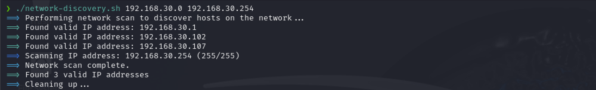

After discovering the target IP, I conducted an `nmap` scan to pinpoint open ports, identify the software running on them, and determine their respective versions.

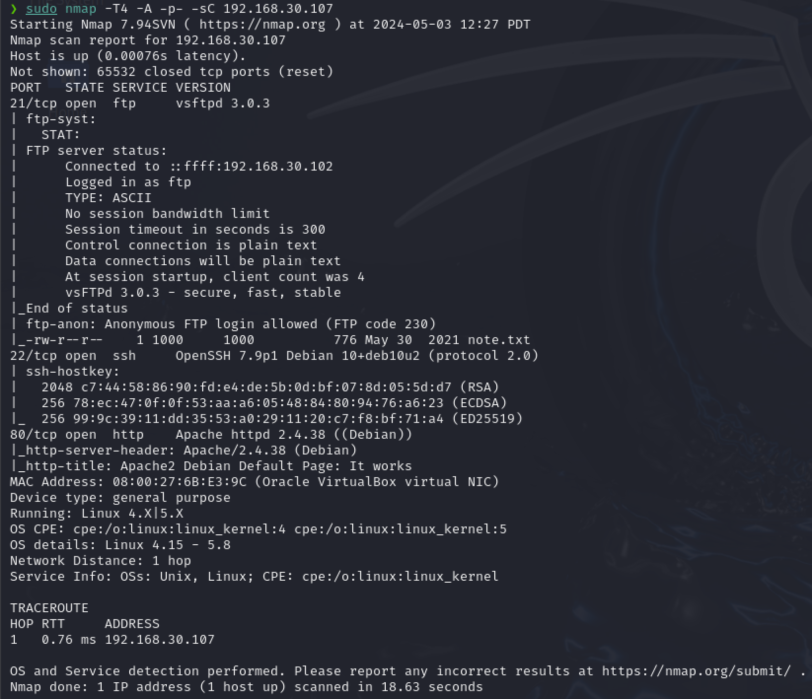

| Port   | Service | Service Version                               | Notes                                                                           |
| ------ | ------- | --------------------------------------------- | ------------------------------------------------------------------------------- |
| 21/tcp | ftp     | vsftpd 3.0.3                                  | Anonymous login is enabled, and a file named `note.txt` can be freely accessed. |
| 22/tcp | ssh     | OpenSSH 7.9p1 Debian 10+deb102 (protocol 2.0) | The Linux distribution we are interacting with is Debian 10.                    |
| 80/tcp | http    | Apache httpd 2.4.38 (Debian)                  | The primary page is the default Apache2 Debian Page.                            |

#### FTP Anonymous Login Scan (Port 21)

As indicated in the table above, the FTP service has enabled "anonymous login". I was able to establish a connection to the `ftp` instance and successfully downloaded `note.txt`, which contained the following message:

```txt
Hello Heath !
Grimmie has setup the test website for the new academy.
I told him not to use the same password everywhere, he will change it ASAP.


I couldn't create a user via the admin panel, so instead I inserted directly into the database with the following command:

INSERT INTO `students` (`StudentRegno`, `studentPhoto`, `password`, `studentName`, `pincode`, `session`, `department`, `semester`, `cgpa`, `creationdate`, `updationDate`) VALUES
('10201321', '', 'cd73502828457d15655bbd7a63fb0bc8', 'Rum Ham', '777777', '', '', '', '7.60', '2021-05-29 14:36:56', '');

The StudentRegno number is what you use for login.


Le me know what you think of this open-source project, it's from 2020 so it should be secure... right ?
We can always adapt it to our needs.

-jdelta
```

Recognizing `cd73502828457d15655bbd7a63fb0bc8` to be a hash, I used [crackstation.net](https://crackstation.net/) to reveal the hashed password to be `student`.

Important info to note:

- StudentRegno: `10201321`
- password: `student`
- studentName: `Rum Ham`
- pincode: `777777`

#### HTTP (Port 80)

##### Nikto

After moving on to Apache, I decided to initiate a web scan using `nikto`. The scan results were quite revealing, indicating the presence of phpMyAdmin, which is known to possess a wide range of attack vectors. Moreover, upon examining the README file, it was discovered that phpMyAdmin was utilizing MySQL as its database.

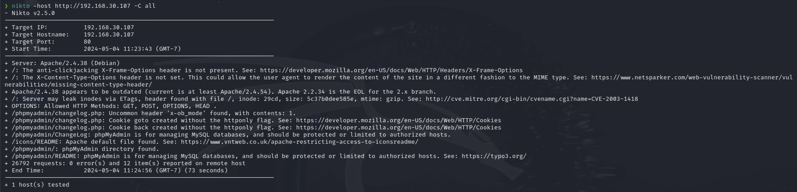

##### GoBuster

After realizing there could be more web directories beyond the ordinary user's sight, I employed `gobuster` to uncover any concealed directories. The scan successfully detected the presence of `http://192.168.30.107/academy/`.

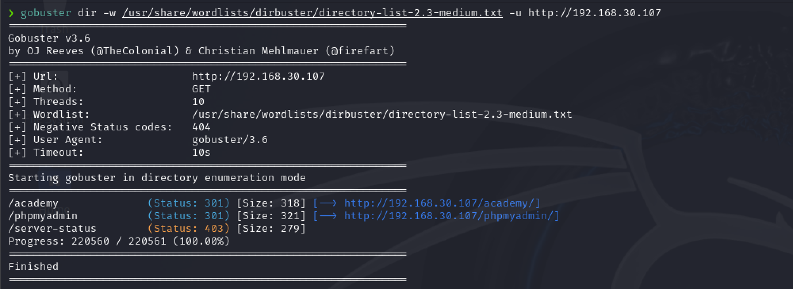

### Vulnerability Report

Before investigating the phpMyAdmin and academy web pages, I conducted vulnerability research on the identified services. During my research, I focused on highly exploitable vulnerabilities that already had existing exploits. To prioritize the vulnerabilities, I considered their high CVE, EPSS, and exploitability scores. It is worth noting that I analyzed the CVEs using both CVSS 3.1 and CVSS 2.0 scores. However, in this document, I present information for all the vulnerabilities based on the CVSS 3.1 score. Therefore, the prioritization I carried out earlier might not necessarily match the ideal scores I was looking for.

| Vulnerability                                                                                                    | Base Severity | CVSS Base Score | EPSS Score | Exploitability | Impact Score | Description                                                                                                                                                                                                                                | Recommendation                                                                                                                                                                                                                                                                          |
| ---------------------------------------------------------------------------------------------------------------- | ------------- | --------------- | ---------- | -------------- | ------------ | ------------------------------------------------------------------------------------------------------------------------------------------------------------------------------------------------------------------------------------------ | --------------------------------------------------------------------------------------------------------------------------------------------------------------------------------------------------------------------------------------------------------------------------------------- |
| [CVE-2021-44790](https://www.cvedetails.com/cve/CVE-2021-44790/ "CVE-2021-44790 security vulnerability details") | 9.8           | CRITICAL        | 8.81%      | 3.9            | 5.9          | A carefully crafted request can cause a buffer overflow in the mod_lua multipart parser. This affects Apache HTTP Server 2.4.51 and earlier. No exploit has been found yet.                                                                | - Update Apache to the latest version to mitigate the vulnerability.<br>- If not needed, disable `mod_lua`.                                                                                                                                                                             |
| [CVE-2021-40438](https://www.cvedetails.com/cve/CVE-2021-40438/ "CVE-2021-40438 security vulnerability details") | 9.0           | CRITICAL        | 97.45%     | 2.2            | 6.0          | Apache HTTP Server 2.4.48 and earlier versions are vulnerable to a mod_proxy exploit that can cause a remote user to select an origin server by crafting a request URI-path.                                                               | - Upgrade to the latest version of Apache that patches this vulnerability. <br>- If not needed, disable `mod_proxy`.<br>- If required and updating is impossible, consider additional security measures such as network segmentation and stricter firewall rules.                       |
| [CVE-2019-0211](https://www.cvedetails.com/cve/CVE-2019-0211/ "CVE-2019-0211 security vulnerability details")    | 7.8           | HIGH            | 97.42%     | 1.8            | 5.9          | In Apache HTTP Server 2.4, versions 2.4.17 to 2.4.38, less-privileged child processes or threads could execute arbitrary code with the privileges of the parent process by manipulating the scoreboard. Non-Unix systems are not affected. | - Update to a version of Apache HTTP Server newer than `2.4.38`. <br>- Employ privilege separation techniques and regular server maintenance checks to ensure system integrity.                                                                                                         |
| [CVE-2021-30047](https://www.cvedetails.com/cve/CVE-2021-30047/ "CVE-2021-30047 security vulnerability details") | 7.5           | HIGH            | 0.28%      | 3.9            | 3.6          | VSFTPD 3.0.3 allows attackers to cause a denial of service due to the limited number of connections allowed.                                                                                                                               | - Upgrade to a newer version of VSFTPD if available or apply any provided patches.<br>- Consider configuring connection rate-limiting and monitoring to prevent denial-of-service attacks.<br>- Alternatively, use SFTP as a safer option that isn't susceptible to this vulnerability. |
| [CVE-2019-6110](https://www.cvedetails.com/cve/CVE-2019-6110/ "CVE-2019-6110 security vulnerability details")    | 6.8           | MEDIUM          | 0.43%      | 1.6            | 5.2          | OpenSSH 7.9 vulnerability allows a malicious server or Man-in-The-Middle attacker to manipulate client output, potentially hiding additional files being transferred.                                                                      | - Update OpenSSH clients to version 7.9p1 or later. <br>- Use more secure methods for file transfer and verify server authenticity before connecting.                                                                                                                                   |
| [CVE-2019-6111](https://www.cvedetails.com/cve/CVE-2019-6111/ "CVE-2019-6111 security vulnerability details")    | 5.9           | MEDIUM          | 0.20%      | 2.2            | 3.6          | OpenSSH 7.9 has a security issue in its scp implementation. A malicious scp server or Man-in-The-Middle attacker can overwrite arbitrary files in the scp client target directory.                                                         | - Patch or update OpenSSH to a version that fixes this scp vulnerability. <br>- Ensure SCP transfers are conducted over trusted networks and verify file integrity post-transfer.                                                                                                       |

Although the mentioned vulnerabilities were indeed present in the software versions captured by `nmap`, it is worth noting that they were not easily exploitable for several reasons. These reasons will be explained in the following points:

- [CVE-2021-44790](https://www.cvedetails.com/cve/CVE-2021-44790/ "CVE-2021-44790 security vulnerability details")
  - There is no proof that `mod_lua` is enabled.
- [CVE-2021-40438](https://www.cvedetails.com/cve/CVE-2021-40438/ "CVE-2021-40438 security vulnerability details")
  - After further investigation, it didn't seem like this vulnerability was as applicable as I thought it was.
- [CVE-2019-0211](https://www.cvedetails.com/cve/CVE-2019-0211/ "CVE-2019-0211 security vulnerability details")
  - This one could have been exploitable, but with my level of experience, the likelihood of this vulnerability being exploited is very low, as indicated by the CVSS exploitability score.
- [CVE-2021-30047](https://www.cvedetails.com/cve/CVE-2021-30047/ "CVE-2021-30047 security vulnerability details")
  - While potentially viable, performing a DoS attack on the system posed no benefit in gaining root access.
- [CVE-2019-6110](https://www.cvedetails.com/cve/CVE-2019-6110/ "CVE-2019-6110 security vulnerability details") & [CVE-2019-6111](https://www.cvedetails.com/cve/CVE-2019-6111/ "CVE-2019-6111 security vulnerability details")
  - Both of these vulnerabilities involved a man in the middle. While potentially good, it was not applicable within the given threat model and scenario.

### Exploitation

Upon examination of the academy website, I discovered that I could utilize the credentials I obtained from the note file to gain access to the student account named "Rum Ham".


After some experimentation, I found an interesting "bug" in the website's 'Profile Picture' section in the "MY PROFILE" tab. I realized that it allowed me to upload non-image files. I researched and found a useful tool called [php-reverse-shell](https://github.com/pentestmonkey/php-reverse-shell) that, if executed correctly, could create a web shell, granting me access to the server. Using this method, I could infiltrate the system and gain entry under the user name 'www-data'.

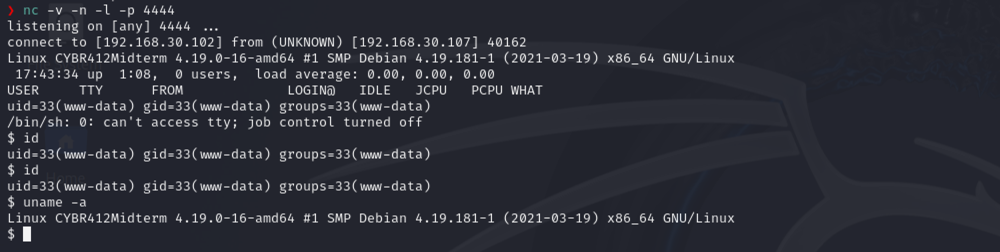

### Privilege Escalation

I've gained access to a user account on the remote system. My next task is to obtain root access. To explore potential paths of privilege escalation, I used `LinPEAS` and meticulously reviewed the output for any useful leads. After sifting through the results, I came across a password that I believe could unlock either further access to the academy webpage or the phpMyAdmin site.

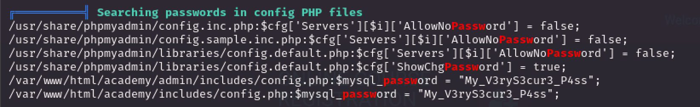

I decided to first check phpMyAdmin since I thought it would be the best place to find the information I needed. But when I tried to log in with the username 'admin', I was denied access. That's when I remembered that LinPEAS had reported a user named 'grimmie'. I tried to log into phpMyAdmin with 'grimmie' as the username and the previous password, and was granted access!

Although I found a lot of good information, it wasn't helpful in terms of getting root access. So, I decided to use the same password to log in to the 'grimmie' user account on the server to potentially escalate my permissions. I figured that if the password was the same for the 'grimmie' user, then it might be the same for the root user too. To check this, I accessed phpMyAdmin and found the hashed password for the root user. I used crackstation.net to get the password, but unfortunately, I was unable to log into the root account with it.

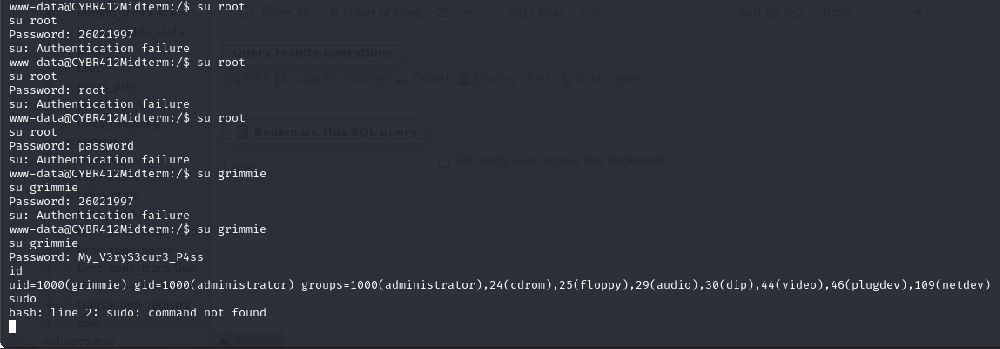
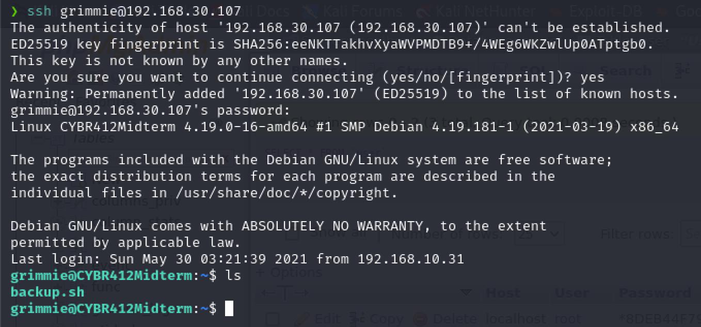

#### Kernel Exploit

Prior to the grimmie's password, what initially caught my attention was the `PTRACE_TRACEME`. This seemed like it would be an easy way to gain escalated privileges, directly to root.

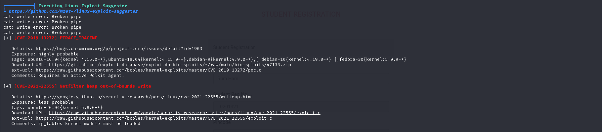

After finding the code to exploit said vulnerability, I compiled it locally, then used `sftp` to upload the code, since I couldn't directly compile it on the remote machine. Once on the system, I attempted to execute the code, but unfortunately, or unfortunately, it wouldn't execute because the required libraries were not installed on the system. This meant that I was unable to exploit this major vulnerability, which in the end, was good.

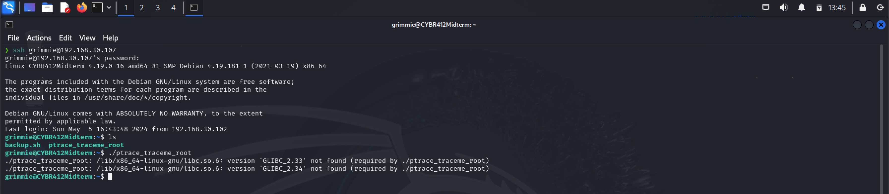

### Privilege Escalation (root)

Since the kernel-level exploit failed, I focused on the `backup.sh` file within the home directory of grimmie. Looking back at the output of LinPEAS, we see that there was a cronjob that executed this file. Even better, it gets executed with root permissions.


Since the script was owned by grimmie, I was able to modify it to instead open a backdoor using `netcat`, allowing me to directly connect as the root user.

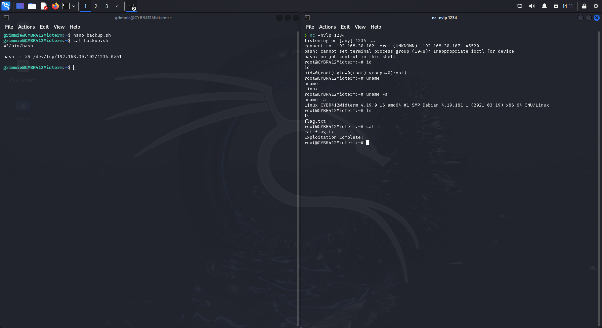
