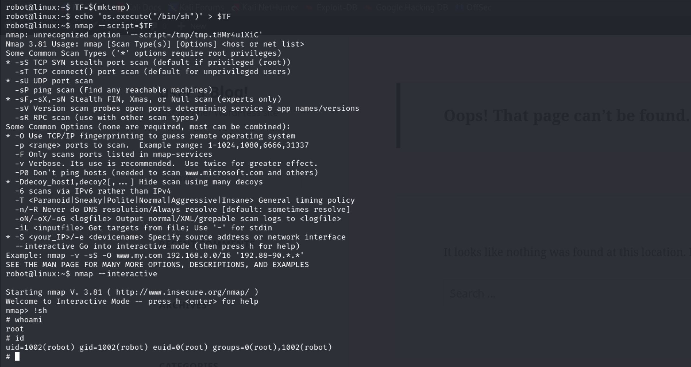

# Mr. Robot CTF

> **Link to room**: https://tryhackme.com/r/room/mrrobot
>
> **Difficulty**: Medium
>
> **Date completed**: June 15, 2024

### Instructions

Can you root this Mr. Robot-styled machine? This is a virtual machine designed for beginners and intermediate users. There are three hidden keys located on the machine. Can you find them?

**Answer the questions below:**

- What is key 1?
  - \_\_\_\_\_\_\_\_\_\_\_\_\_\_\_
- What is key 2?
  - \_\_\_\_\_\_\_\_\_\_\_\_\_\_\_
- What is key 3?
  - \_\_\_\_\_\_\_\_\_\_\_\_\_\_\_

### Note

Halfway through this CTF, I ran out of time and had to redeploy the VM. This is why you may notice different IP addresses representing the target machine. For convenience, I'll provide a list of all the IPs of the target machine:

- 10.10.84.157
- 10.10.159.68

## Port Scan (nmap)

First and foremost, I performed a port scan using `nmap` to identify any open ports and the software running on them.

```
┌──(parallels㉿kali)-[~]
└─$ sudo nmap -T4 -sC -p- 10.10.84.157
Nmap scan report for 10.10.84.157
Host is up (0.17s latency).
Not shown: 65532 filtered tcp ports (no-response)
PORT    STATE  SERVICE
22/tcp  closed ssh
80/tcp  open   http
|_http-title: Site doesn't have a title (text/html).
443/tcp open   https
|_http-title: Site doesn't have a title (text/html).
| ssl-cert: Subject: commonName=www.example.com
| Not valid before: 2015-09-16T10:45:03
|_Not valid after:  2025-09-13T10:45:03

Nmap done: 1 IP address (1 host up) scanned in 205.51 seconds
```

The results of the scan indicated that the following ports were open and closed:

- **22/tcp:** SSH (Closed)
- **80/tcp:** HTTP (Open)
- **443/tcp:** HTTPS (Open)

Since SSH seemed to be closed, my next step was to identify and investigate the web application running on ports 80 and 443.

## Web Enumeration and Investigation

To identify possible pages and web directories that weren't visible at first glance, I used `gobuster`.


The following were the most notable findings that I believed would yield some useful results:

- `/wp-login`
- `/robots.txt`
- `/license`
- `/readme`
- `/sitemap`

### WordPress Login

As the results of the `gobuster` scan suggested, WordPress appeared to be installed on the target machine. I decided to look at the login page to confirm this.


I left the website's WordPress section on hold while examining the other available files and directories.

### robots.txt

The `gobuster` scan also indicated that `robots.txt` existed. Here is the content of `robots.txt`:


Accessing `key-1-of-3.txt` from the browser, I observed that it contained the first of the three keys. <mark>Great! I found the first key and now had two more to go.</mark>


### Downloaded Wordlist

The `robots.txt` file also indicated the presence of another file named `fsocity.dic`. After downloading the file and viewing its contents, I noticed it appeared to be a wordlist. To get rid of the many duplicate words, I executed `sort fsocity.dic | uniq > uniq_fsocity.dic`. This number of words in the file was reduced from 858,160 to 11,451.

### WordPress Access

After sifting through the file, I noticed the name "Elliot," which is the main character of the show on which this VM is based. This name might be the username for the WordPress site. Given that this wordlist might contain a password, it would be worth using it to brute-force the WordPress website. First, I checked if Elliot was an existing user based on the output of the WordPress login screen.


After confirming that I could use "Elliot" as the username, I used `wpscan` to brute-force the WordPress login page with the wordlist as a password list.


I successfully logged into the WordPress website using the username and newly identified password.


### Reverse Web Shell

Now that I had access to an administrator account, I needed to modify or add a new PHP file to perform a reverse web shell. After some searching, I found that I could do this in `Appearance => Editor` by modifying the `404.php` template. I added the [PHP code](https://raw.githubusercontent.com/pentestmonkey/php-reverse-shell/master/php-reverse-shell.php) to open a reverse shell.


After updating the template, I set up `netcat` to listen on port 1639, which the PHP file would initiate the connect to. Accessing a web page that resulted in a 404 error, triggered the PHP code and gave me direct access to the system.


## Privilege Escalation Part 1

First, I gave myself a TTY with `python3 -c 'import pty; pty.spawn("/bin/bash")'`. This allowed me to interact more easily with the system. After noticing that the user `robot` had their home directory permissions set to allow anyone to read its contents, I decided to take a peek. <mark>Here, I found the second key, which I was unable to access without root permissions or being the `robot` user.</mark> Thankfully, there was a hash file that might contain the user's password. Using [Crack Station](https://crackstation.net/), I obtained the password `abcdefghijklmnopqrstuvwxyz`:


<mark>With that, I successfully gained access to the robot user and retrieved the second of the three keys:</mark>


## Privilege Escalation Part 2

Next, I attempted to become root. Initially, I tried to get [linpeas](https://github.com/peass-ng/PEASS-ng/tree/master/linPEAS) on the system, but this proved difficult. So instead, I decided to use the old-fashioned method of finding all executables with a SUID bit in place:


After consulting [GTFOBins](https://gtfobins.github.io/), I discovered that I could perform privilege escalation using `nmap` in interactive mode.



Now with root permissions, I checked the contents of `/root` to see if the third key was there. <mark>And indeed, it was! I had successfully found all three keys</mark>:


